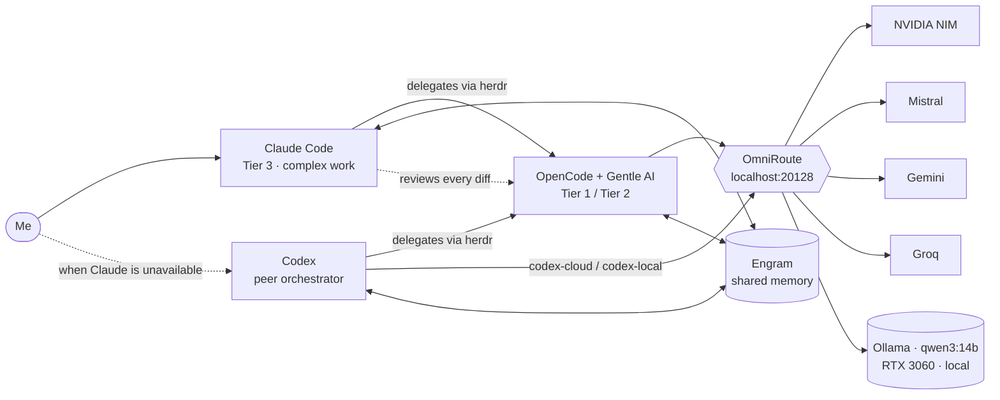

<picture>
  <source media="(prefers-color-scheme: dark)" srcset="assets/banner-dark.svg">
  <source media="(prefers-color-scheme: light)" srcset="assets/banner-light.svg">
  
</picture>

<div align="center">

   

</div>

This is the environment I code in every day — and honestly, the thing I am proudest of building.

**Claude Code** does the thinking. Whenever a task is trivial or well-scoped, it hands it off through **herdr** to **OpenCode** agents. Those agents talk to **OmniRoute**, which routes every request through free-tier cloud models and falls back to **qwen3:14b running on my own GPU**. **Engram** gives all of them the same memory, and Claude reviews every diff before it counts.

When Claude Code is unavailable, **Codex** steps in as a second, independent orchestrator — same OmniRoute combos, same shared memory, one command away. It is a *peer*, not a delegated agent.

The result: frontier-level judgment where it matters, **$0 for the delegated work**, and a pipeline that keeps working even when every cloud quota runs out.

## ✨ Highlights

- 💵 **$20/month, total** — one Claude Pro subscription; every other model and tool is free-tier or open-source.
- 🧠 **One brain, many hands** — Claude keeps architecture, debugging and security; cheaper models handle renames, tests and boilerplate.
- 🤝 **A backup brain** — Codex runs the same pipeline as an independent peer when Claude Code is down, with `codex-cloud` / `codex-local`.
- 🔀 **Three routing combos, five providers** — each combo degrades gracefully from the best free model down to local AI.
- 🖥 **Local AI that fits** — `qwen3:14b` tuned to run 100% on a 12 GB RTX 3060 with a 16k context.
- 🧬 **Shared memory** — Engram persists decisions and conventions across every agent and session.
- 🔐 **Secrets never touch git** — environment variables plus an `age`-encrypted backup; the gateway only listens on localhost.
- ♻️ **Rebuildable from scratch** — bootstrap, restore and idempotent patch scripts bring a fresh machine back to this exact state.

## 🏗 How it fits together



## 🧰 The stack

| Layer | Tool | What it does here |
|-------|------|-------------------|
| Brain | [Claude Code](https://claude.com/claude-code) | Plans, decides what to delegate, writes the hard parts, reviews everything |
| Peer brain | [Codex](https://github.com/openai/codex) | Independent orchestrator when Claude Code is unavailable — same OmniRoute combos |
| Orchestration | [herdr](https://github.com/herdrdev/herdr) | Lets Claude spawn and supervise agents in terminal panes |
| Agents | [OpenCode](https://opencode.ai) + [Gentle AI](https://github.com/Gentleman-Programming/gentle-ai) | Executes delegated tasks with the same conventions and skills |
| Gateway | [OmniRoute](https://www.npmjs.com/package/omniroute) | OpenAI-compatible proxy with priority combos, param filters and prompt compression |
| Cloud models | NVIDIA NIM · Mistral · Gemini · Groq | Free tiers only, official API keys, billing never enabled |
| Local model | [Ollama](https://ollama.com) + `qwen3:14b` | Private, offline, always-available last fallback |
| Memory | [Engram](https://github.com/Gentleman-Programming/engram) | Persistent memory shared by every agent |

## 🔀 Routing combos

Every combo uses a **priority** strategy: the first healthy provider answers, the rest are fallbacks.

| Combo | Used for | Route |
|-------|----------|-------|
| `elvinlabFast` | Tier 1 · trivial | Groq `gpt-oss-120b` → Groq `gpt-oss-20b` → NVIDIA `nemotron-3.5-lightning` → **local `qwen3:14b`** |
| `elvinlabCode` | Tier 2 · bounded | NVIDIA `nemotron-3-ultra` → Mistral `codestral` → Gemini `3-flash` → **local `qwen3:14b`** |
| `elvinlabLocal` | Offline / private | **local `qwen3:14b`** only |

Switching the whole delegation between cloud and local is one command: `agent-profile cloud` or `agent-profile local`. Full provider setup lives in [`docs/OMNIROUTE.md`](docs/OMNIROUTE.md).

### Delegation tiers

| Tier | Model | Typical work |
|---|---|---|
| 1 · Trivial | `TIER1_MODEL` → `elvinlabFast` | Renames, lint fixes, i18n strings, commit messages, mechanical 1–2 file edits |
| 2 · Bounded | `TIER2_MODEL` → `elvinlabCode` | Tests, boilerplate, docs, simple components, refactors with a clear spec |
| 3 · Complex | Claude Code itself | Architecture, design decisions, hard debugging, security-sensitive code, ambiguous requirements |

Models are never hardcoded: Claude reads `~/.config/agent-routing/active.env` before every delegation. The complete rules live in [`home/.claude/delegation-block.md`](home/.claude/delegation-block.md).

## 🤝 Codex as a peer orchestrator

Claude Code is the default brain, but it is not the only one. When it is unavailable, **Codex** drives the same pipeline as an *independent* orchestrator — never a delegated agent. Two repo-managed profiles wire it straight into OmniRoute:

| Command | Profile | Combo | Use |
|---------|---------|-------|-----|
| `codex-cloud` | `elvinlab-cloud` | `elvinlabCode` | Cloud-first, degrades to local |
| `codex-local` | `elvinlab-local` | `elvinlabLocal` | Local `qwen3:14b` only |

The profiles live in [`home/.config/codex-profiles/`](home/.config/codex-profiles/) and are deployed by `apply-patches.sh` through [`scripts/install-codex-profiles.sh`](scripts/install-codex-profiles.sh). The installer is **conservative by design**: it refuses to overwrite your existing `~/.codex/config.toml`, auth or any other profile — a conflicting file stops the install instead of clobbering it. The API key comes from `OMNIROUTE_API_KEY`; nothing secret is written to disk.

**Same tiers as Claude.** Codex doesn't just run a model — it delegates like Claude does. `apply-patches.sh` injects [`home/.codex/delegation-block.md`](home/.codex/delegation-block.md) into `~/.codex/AGENTS.md` (outside the gentle-ai managed regions, idempotently), so Codex reads the **same** `~/.config/agent-routing/active.env` and routes trivial → `TIER1_MODEL`, bounded → `TIER2_MODEL` through herdr + OpenCode, keeping complex work for itself. One `agent-profile cloud|local` switches **both** brains at once.

## 🖥 Local AI: qwen3:14b on an RTX 3060

A 14B model on a 12 GB consumer GPU only works if every byte of VRAM counts. The Ollama service is tuned with a [systemd override](system/etc/systemd/system/ollama.service.d/override.conf):

| Setting | Value | Why |
|---------|-------|-----|
| `OLLAMA_FLASH_ATTENTION` | `1` | Faster attention with less memory |
| `OLLAMA_KV_CACHE_TYPE` | `q8_0` | Halves the KV cache so the 16k context fits in VRAM |
| `OLLAMA_CONTEXT_LENGTH` | `16384` | Enough context for real coding tasks |
| `OLLAMA_NUM_PARALLEL` | `1` | One request at a time, no VRAM splitting |
| `OLLAMA_MAX_LOADED_MODELS` | `1` | Never two models competing for the GPU |
| `OLLAMA_KEEP_ALIVE` | `30m` | Stays warm during a session, frees the GPU afterwards |

The service is **on demand**: it never starts at boot. `ollama-up` and `ollama-down` start and stop it, so the GPU stays free when I am not coding.

> **GPU sizing note:** The reference is RTX 3060 12 GB + `qwen3:14b` + 16k context (`OLLAMA_CONTEXT_LENGTH`). With less VRAM, use a smaller model or shorter context (edit `OLLAMA_CONTEXT_LENGTH` / the model tag). With no NVIDIA GPU, Ollama runs on CPU (much slower) — the cloud combos still work.

## ⌨️ My workstation

This is the author's reference machine; any supported distro (Arch, Debian/Ubuntu, Fedora) or WSL2 works.

| | |
|---|---|
| **OS** | [Omarchy](https://omarchy.org) 4 — Arch Linux + Hyprland |
| **Terminal** | foot · bash · tmux |
| **Editor** | Neovim + LazyVim |
| **CPU** | AMD Ryzen 5 5600X |
| **GPU** | NVIDIA GeForce RTX 3060 · 12 GB |

<details>
<summary><b>Versions this setup was tested with (September 2026)</b></summary>

| Tool | Version |
|------|---------|
| Omarchy | 4.0.4 |
| Hyprland | 0.56.2 |
| Neovim | 0.12.5 |
| Claude Code | 2.1.282 |
| Codex | 0.158.0 |
| OpenCode | 1.18.32 |
| herdr | 0.9.1 |
| Gentle AI | 3.7.0 |
| Engram | 2.2.0 |
| OmniRoute | 3.8.50 |
| Ollama | 0.33.3 |

</details>

## 🛡 Design decisions

- **Secrets never touch git.** Keys are read from environment variables (`{env:OMNIROUTE_API_KEY}`). Provider keys, databases and memory are backed up in an [`age`](https://github.com/FiloSottile/age)-encrypted archive.
- **Localhost only.** OmniRoute binds to `127.0.0.1` and requires an API key; the OpenCode key has no management access. No tunnels.
- **Graceful degradation.** Quotas run out; the pipeline does not. Every combo ends on local AI.
- **"Local" means routed to local, not sealed.** `codex-local` and the `elvinlabLocal` combo reach the local model *through* OmniRoute — the privacy guarantee lives in the routing, not the client. Repoint that alias and "local" follows it.
- **Idempotent patches.** `apply-patches.sh` deep-merges the OmniRoute provider into OpenCode and injects a marked block into `CLAUDE.md` — safe to rerun after every Gentle AI update.
- **Humans stay in charge.** Cheaper models never ship unreviewed code; free models sometimes invent facts, so Claude verifies every claim.
- **Lessons are written down.** Every problem solved along the way is in [`docs/LESSONS.md`](docs/LESSONS.md).

## 📁 Repository layout

```
agentic-dev-setup/
├── assets/                        ← README banner
├── docs/
│   ├── SETUP.md                   ← backup, rebuild and verification guide
│   ├── OMNIROUTE.md               ← providers, combos, filters, compression
│   └── LESSONS.md                 ← problems already solved and how
├── scripts/
│   ├── bootstrap.sh               ← installs and configures a fresh machine
│   ├── backup.sh                  ← encrypted backup of secrets and data
│   ├── restore-data.sh            ← restores the encrypted backup
│   ├── apply-patches.sh           ← custom additions on top of Gentle AI
│   └── install-codex-profiles.sh  ← installs Codex profiles + launchers
├── home/                          ← files that go in $HOME
│   ├── .bashrc.d/ai.sh            ← aliases, agent-profile, secret loading
│   ├── .bashrc.d/codex.sh         ← codex-cloud / codex-local launchers
│   ├── .claude/delegation-block.md
│   └── .config/
│       ├── agent-routing/         ← cloud / local model profiles (.example)
│       └── codex-profiles/        ← Codex OmniRoute profile layers
├── omniroute/env.additions.example
├── patches/opencode-provider.json
├── system/etc/systemd/system/ollama.service.d/override.conf
└── tools/                         ← banner generator
```

## 📚 Documentation

| I want to… | Go to |
|------------|-------|
| Know what I need (accounts, cost, hardware, knowledge) | [docs/REQUIREMENTS.md](docs/REQUIREMENTS.md) |
| Install or rebuild the environment | [docs/SETUP.md](docs/SETUP.md) |
| Run it on Windows (WSL2) | [docs/SETUP.md](docs/SETUP.md) |
| Configure OmniRoute providers & combos | [docs/OMNIROUTE.md](docs/OMNIROUTE.md) |
| Make it my own (names, profiles, models) | [docs/CUSTOMIZATION.md](docs/CUSTOMIZATION.md) |
| Handle API keys & secrets safely | [docs/SECRETS.md](docs/SECRETS.md) |
| See tested distros / GPUs (or report mine) | [docs/COMPATIBILITY.md](docs/COMPATIBILITY.md) |
| Fix a known problem | [docs/LESSONS.md](docs/LESSONS.md) |
| Contribute | [CONTRIBUTING.md](CONTRIBUTING.md) |
| Report a vulnerability | [SECURITY.md](SECURITY.md) |

## 🚀 Quick start

New here? See [`docs/REQUIREMENTS.md`](docs/REQUIREMENTS.md) for the accounts, hardware and knowledge you need before starting.

Bootstrap supports Arch, Debian/Ubuntu, Fedora, and Windows via WSL2. See [`docs/SETUP.md`](docs/SETUP.md) for WSL2 details.

See [`docs/COMPATIBILITY.md`](docs/COMPATIBILITY.md) for tested distros and GPUs (and add yours).

```bash
git clone https://github.com/elvinlab/agentic-dev-setup.git
cd agentic-dev-setup
chmod +x scripts/*.sh
./scripts/bootstrap.sh
```

Then follow [`docs/SETUP.md`](docs/SETUP.md) to restore data, install Gentle AI and apply the patches.

```bash
ss -tlnp | grep 20128                        # → 127.0.0.1:20128
curl -s http://localhost:20128/v1/models     # → Authentication required
opencode models omniroute                    # → elvinlabCode, elvinlabFast, elvinlabLocal
agent-profile                                # → Active: cloud
codex-cloud "reply pong"                     # → Codex through OmniRoute (cloud)
codex-local "reply pong"                     # → Codex through the local qwen3:14b
```

The full checklist is in [`docs/SETUP.md`](docs/SETUP.md#verification).

---

<div align="center">

Built with care by [Elvin González](https://github.com/elvinlab) · [elvinlab.dev](https://elvinlab.dev) · [MIT License](LICENSE)

</div>
