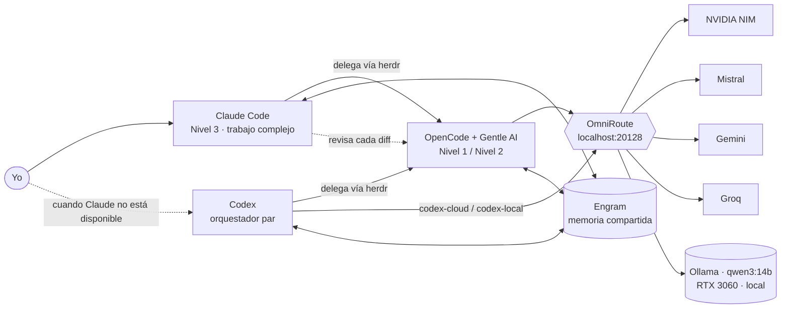

<picture>
  <source media="(prefers-color-scheme: dark)" srcset="assets/banner-dark.svg">
  <source media="(prefers-color-scheme: light)" srcset="assets/banner-light.svg">
  
</picture>

**Español** · [English](README.en.md)

<div align="center">

   

</div>

Este es el entorno en el que programo cada día —y honestamente, lo que más orgulloso estoy de haber construido.

**Claude Code** hace el razonamiento. Cuando una tarea es trivial o bien delimitada, la pasa a través de **herdr** a los agentes de **OpenCode**. Esos agentes hablan con **OmniRoute**, que enruta cada petición mediante modelos gratuitos en la nube y cae en **qwen3:14b ejecutándose en mi propia GPU**. **Engram** les da a todos la misma memoria, y Claude revisa cada diff antes de que cuente.

Cuando Claude Code no está disponible, **Codex** entra como un segundo orquestador independiente —mismos combos OmniRoute, misma memoria compartida, a un comando de distancia. Es un *par*, no un agente delegado.

El resultado: juicio a nivel frontera donde importa, **$0 en el trabajo delegado**, y una tubería que sigue funcionando incluso cuando se agota cada cuota en la nube.

## ✨ Destacados

- 💵 **$20/mes, total** — una suscripción Claude Pro; todos los demás modelos y herramientas son gratuitos o de código abierto.
- 🧠 **Un cerebro, muchas manos** — Claude mantiene arquitectura, depuración y seguridad; modelos más baratos manejan renombrados, tests y código repetitivo.
- 🤝 **Un cerebro de respaldo** — Codex ejecuta la misma tubería como par independiente cuando Claude Code cae, con `codex-cloud` / `codex-local`.
- 🔀 **Tres combos de enrutamiento, cinco proveedores** — cada combo degrada con elegancia desde el mejor modelo gratuito hasta la IA local.
- 🖥 **IA local que cabe** — `qwen3:14b` ajustado para correr 100 % en una RTX 3060 de 12 GB con contexto de 16k.
- 🧬 **Memoria compartida** — Engram persiste decisiones y convenciones a través de cada agente y sesión.
- 🔐 **Los secretos nunca tocan git** — variables de entorno más respaldo encriptado con `age`; la puerta de enlace solo escucha en localhost.
- ♻️ **Reconstruible desde cero** — scripts de arranque, restauración y parches idempotentes devuelven una máquina fresca a este estado exacto.

## 🏗 Cómo encaja todo



## 🧰 La pila

| Capa | Herramienta | Qué hace aquí |
|------|-------------|---------------|
| Cerebro | [Claude Code](https://claude.com/claude-code) | Planifica, decide qué delegar, escribe las partes difíciles, revisa todo |
| Cerebro par | [Codex](https://github.com/openai/codex) | Orquestador independiente cuando Claude Code no está disponible — mismos combos OmniRoute |
| Orquestación | [herdr](https://github.com/herdrdev/herdr) | Permite a Claude crear y supervisar agentes en paneles de terminal |
| Agentes | [OpenCode](https://opencode.ai) + [Gentle AI](https://github.com/Gentleman-Programming/gentle-ai) | Ejecuta tareas delegadas con las mismas convenciones y skills |
| Puerta de enlace | [OmniRoute](https://www.npmjs.com/package/omniroute) | Proxy compatible con OpenAI con combos de prioridad, filtros de parámetros y compresión de prompts |
| Modelos cloud | NVIDIA NIM · Mistral · Gemini · Groq | Solo niveles gratuitos, claves API oficiales, facturación nunca habilitada |
| Modelo local | [Ollama](https://ollama.com) + `qwen3:14b` | Privado, sin conexión, siempre disponible como último recurso |
| Memoria | [Engram](https://github.com/Gentleman-Programming/engram) | Memoria persistente compartida por cada agente |

## 🔀 Combos de enrutamiento

Cada combo usa una estrategia de **prioridad**: el primer proveedor sano responde, el resto son fallbacks.

| Combo | Usado para | Ruta |
|-------|------------|------|
| `elvinlabFast` | Nivel 1 · trivial | Groq `gpt-oss-120b` → Groq `gpt-oss-20b` → NVIDIA `nemotron-3.5-lightning` → **local `qwen3:14b`** |
| `elvinlabCode` | Nivel 2 · acotado | NVIDIA `nemotron-3-ultra` → Mistral `codestral` → Gemini `3-flash` → **local `qwen3:14b`** |
| `elvinlabLocal` | Sin conexión / privado | **local `qwen3:14b`** solo |

Cambiar toda la delegación entre nube y local es un comando: `agent-profile cloud` o `agent-profile local`. La configuración completa de proveedores está en [`docs/OMNIROUTE.md`](docs/OMNIROUTE.md).

### Niveles de delegación

| Nivel | Modelo | Trabajo típico |
|---|---|---|
| 1 · Trivial | `TIER1_MODEL` → `elvinlabFast` | Renombrados, correcciones de lint, strings i18n, mensajes de commit, ediciones mecánicas de 1–2 archivos |
| 2 · Acotado | `TIER2_MODEL` → `elvinlabCode` | Tests, boilerplate, docs, componentes simples, refactorizaciones con especificación clara |
| 3 · Complejo | El propio Claude Code | Arquitectura, decisiones de diseño, depuración difícil, código sensible a seguridad, requisitos ambiguos |

Los modelos nunca se codifican duro: Claude lee `~/.config/agent-routing/active.env` antes de cada delegación. Las reglas completas están en [`home/.claude/delegation-block.md`](home/.claude/delegation-block.md).

## 🤝 Codex como orquestador par

Claude Code es el cerebro por defecto, pero no es el único. Cuando no está disponible, **Codex** conduce la misma tubería como *orquestador* independiente —nunca un agente delegado. Dos perfiles gestionados por el repo lo conectan directamente a OmniRoute:

| Comando | Perfil | Combo | Uso |
|---------|--------|-------|-----|
| `codex-cloud` | `elvinlab-cloud` | `elvinlabCode` | Primero la nube, degrada a local |
| `codex-local` | `elvinlab-local` | `elvinlabLocal` | Solo `qwen3:14b` local |

Los perfiles viven en [`home/.config/codex-profiles/`](home/.config/codex-profiles/) y los despliega `apply-patches.sh` mediante [`scripts/install-codex-profiles.sh`](scripts/install-codex-profiles.sh). El instalador es **conservador por diseño**: se niega a sobrescribir tu `~/.codex/config.toml` existente, auth o cualquier otro perfil — un archivo en conflicto detiene la instalación en lugar de machacarlo. La clave API viene de `OMNIROUTE_API_KEY`; nada secreto se escribe en disco.

**Mismos niveles que Claude.** Codex no solo corre un modelo — delega como hace Claude. `apply-patches.sh` inyecta [`home/.codex/delegation-block.md`](home/.codex/delegation-block.md) en `~/.codex/AGENTS.md` (fuera de las regiones gestionadas por gentle-ai, idempotentemente), así Codex lee el **mismo** `~/.config/agent-routing/active.env` y enruta trivial → `TIER1_MODEL`, acotado → `TIER2_MODEL` a través de herdr + OpenCode, guardando el trabajo complejo para sí mismo. Un `agent-profile cloud|local` cambia **ambos** cerebros a la vez.

## 🖥 IA local: qwen3:14b en una RTX 3060

Un modelo de 14B en una GPU de consumidor de 12 GB solo funciona si cada byte de VRAM cuenta. El servicio de Ollama está ajustado con una [anulación de systemd](system/etc/systemd/system/ollama.service.d/override.conf):

| Ajuste | Valor | Por qué |
|--------|-------|---------|
| `OLLAMA_FLASH_ATTENTION` | `1` | Atención más rápida con menos memoria |
| `OLLAMA_KV_CACHE_TYPE` | `q8_0` | Reduce a la mitad la caché KV para que el contexto de 16k quepa en VRAM |
| `OLLAMA_CONTEXT_LENGTH` | `16384` | Suficiente contexto para tareas reales de código |
| `OLLAMA_NUM_PARALLEL` | `1` | Una petición a la vez, sin dividir VRAM |
| `OLLAMA_MAX_LOADED_MODELS` | `1` | Nunca dos modelos compitiendo por la GPU |
| `OLLAMA_KEEP_ALIVE` | `30m` | Se mantiene caliente durante una sesión, libera la GPU después |

El servicio es **bajo demanda**: nunca arranca en el arranque. `ollama-up` y `ollama-down` lo inician y detienen, así la GPU queda libre cuando no estoy programando.

> **Nota sobre dimensionamiento de GPU:** La referencia es RTX 3060 12 GB + `qwen3:14b` + contexto 16k (`OLLAMA_CONTEXT_LENGTH`). Con menos VRAM, use un modelo menor o contexto más corto (edite `OLLAMA_CONTEXT_LENGTH` / la etiqueta del modelo). Sin GPU NVIDIA, Ollama corre en CPU (mucho más lento) — los combos en la nube siguen funcionando.

## ⌨️ Mi estación de trabajo

Esta es la máquina de referencia del autor; cualquier distro soportada (Arch, Debian/Ubuntu, Fedora) o WSL2 funciona.

| | |
|---|---|
| **SO** | [Omarchy](https://omarchy.org) 4 — Arch Linux + Hyprland |
| **Terminal** | foot · bash · tmux |
| **Editor** | Neovim + LazyVim |
| **CPU** | AMD Ryzen 5 5600X |
| **GPU** | NVIDIA GeForce RTX 3060 · 12 GB |

<details>
<summary><b>Versiones con las que se probó este setup (septiembre 2026)</b></summary>

| Herramienta | Versión |
|-------------|---------|
| Omarchy | 4.0.4 |
| Hyprland | 0.56.2 |
| Neovim | 0.12.5 |
| Claude Code | 2.1.282 |
| Codex | 0.158.0 |
| OpenCode | 1.18.32 |
| herdr | 0.9.1 |
| Gentle AI | 3.7.0 |
| Engram | 2.2.0 |
| OmniRoute | 3.8.50 |
| Ollama | 0.33.3 |

</details>

## 🛡 Decisiones de diseño

- **Los secretos nunca tocan git.** Las claves se leen de variables de entorno (`{env:OMNIROUTE_API_KEY}`). Claves de proveedores, bases de datos y memoria se respaldan en un archivo encriptado con [`age`](https://github.com/FiloSottile/age).
- **Solo localhost.** OmniRoute se enlaza a `127.0.0.1` y requiere clave API; la clave de OpenCode no tiene acceso de gestión. Sin túneles.
- **Degradación elegante.** Las cuotas se agotan; la tubería no. Cada combo termina en IA local.
- **«Local» significa enrutado a local, no sellado.** `codex-local` y el combo `elvinlabLocal` alcanzan el modelo local *a través* de OmniRoute — la garantía de privacidad vive en el enrutamiento, no en el cliente. Reapunte ese alias y «local» lo sigue.
- **Parches idempotentes.** `apply-patches.sh` hace deep-merge del proveedor OmniRoute en OpenCode e inyecta un bloque marcado en `CLAUDE.md` — seguro de re-ejecutar tras cada actualización de Gentle AI.
- **Los humanos siguen al mando.** Los modelos baratos nunca envían código sin revisar; los modelos gratuitos a veces inventan hechos, así que Claude verifica cada afirmación.
- **Las lecciones se escriben.** Cada problema resuelto en el camino está en [`docs/LESSONS.md`](docs/LESSONS.md).

## 📁 Estructura del repositorio

```
agentic-dev-setup/
├── assets/                        ← banner del README
├── docs/
│   ├── SETUP.md                   ← guía de respaldo, reconstrucción y verificación
│   ├── OMNIROUTE.md               ← proveedores, combos, filtros, compresión
│   └── LESSONS.md                 ← problemas ya resueltos y cómo
├── scripts/
│   ├── bootstrap.sh               ← instala y configura una máquina fresca
│   ├── backup.sh                  ← respaldo encriptado de secretos y datos
│   ├── restore-data.sh            ← restaura el respaldo encriptado
│   ├── apply-patches.sh           ← adiciones personalizadas sobre Gentle AI
│   └── install-codex-profiles.sh  ← instala perfiles Codex + lanzadores
├── home/                          ← archivos que van en $HOME
│   ├── .bashrc.d/ai.sh            ← alias, agent-profile, carga de secretos
│   ├── .bashrc.d/codex.sh         ← lanzadores codex-cloud / codex-local
│   ├── .claude/delegation-block.md
│   └── .config/
│       ├── agent-routing/         ← perfiles cloud / local de modelos (.example)
│       └── codex-profiles/        ← capas de perfiles Codex OmniRoute
├── omniroute/env.additions.example
├── patches/opencode-provider.json
├── system/etc/systemd/system/ollama.service.d/override.conf
└── tools/                         ← generador de banner
```

## 📚 Documentación

| Quiero… | Ir a |
|---------|------|
| Saber qué necesito (cuentas, coste, hardware, conocimientos) | [docs/REQUIREMENTS.md](docs/REQUIREMENTS.md) |
| Instalar o reconstruir el entorno | [docs/SETUP.md](docs/SETUP.md) |
| Ejecutarlo en Windows (WSL2) | [docs/SETUP.md](docs/SETUP.md) |
| Configurar proveedores y combos de OmniRoute | [docs/OMNIROUTE.md](docs/OMNIROUTE.md) |
| Hacerlo mío (nombres, perfiles, modelos) | [docs/CUSTOMIZATION.md](docs/CUSTOMIZATION.md) |
| Manejar claves API y secretos con seguridad | [docs/SECRETS.md](docs/SECRETS.md) |
| Ver distros / GPUs probados (o reportar la mía) | [docs/COMPATIBILITY.md](docs/COMPATIBILITY.md) |
| Arreglar un problema conocido | [docs/LESSONS.md](docs/LESSONS.md) |
| Contribuir | [CONTRIBUTING.md](CONTRIBUTING.md) |
| Reportar una vulnerabilidad | [SECURITY.md](SECURITY.md) |

## 🚀 Inicio rápido

¿Nuevo por aquí? Vea [`docs/REQUIREMENTS.md`](docs/REQUIREMENTS.md) para las cuentas, hardware y conocimientos que necesita antes de empezar.

El arranque soporta Arch, Debian/Ubuntu, Fedora, y Windows vía WSL2. Vea [`docs/SETUP.md`](docs/SETUP.md) para detalles de WSL2.

Vea [`docs/COMPATIBILITY.md`](docs/COMPATIBILITY.md) para distros y GPUs probados (y añada la suya).

```bash
git clone https://github.com/elvinlab/agentic-dev-setup.git
cd agentic-dev-setup
chmod +x scripts/*.sh
./scripts/bootstrap.sh
```

Luego siga [`docs/SETUP.md`](docs/SETUP.md) para restaurar datos, instalar Gentle AI y aplicar los parches.

```bash
ss -tlnp | grep 20128                        # → 127.0.0.1:20128
curl -s http://localhost:20128/v1/models     # → Authentication required
opencode models omniroute                    # → elvinlabCode, elvinlabFast, elvinlabLocal
agent-profile                                # → Active: cloud
codex-cloud "reply pong"                     # → Codex a través de OmniRoute (cloud)
codex-local "reply pong"                     # → Codex a través del qwen3:14b local
```

La lista completa de verificación está en [`docs/SETUP.md`](docs/SETUP.md).

---

<div align="center">

Construido con cuidado por [Elvin González](https://github.com/elvinlab) · [elvinlab.dev](https://elvinlab.dev) · [Licencia MIT](LICENSE)

</div>