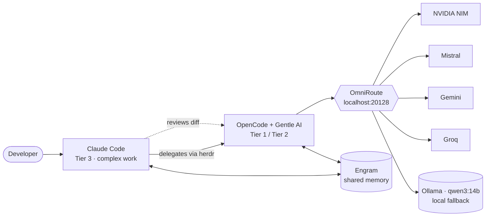

# agentic-dev-setup

> A multi-agent development environment where Claude Code does the thinking and cheaper models do the typing.

## Why

Frontier models are excellent at architecture, debugging and ambiguous problems — and wasteful for renames, boilerplate and commit messages. This setup routes each task to the cheapest model that can do it well:

- **Claude Code** is the brain. It handles complex work and decides what to delegate.
- **herdr** lets Claude spawn and supervise **OpenCode** agents (with **Gentle AI**) in terminal panes.
- **OmniRoute** exposes priority "combos" over free-tier providers (NVIDIA NIM, Mistral, Gemini, Groq), with local **Ollama** as the last fallback.
- **Engram** gives every agent the same persistent memory.

Claude reviews every delegated diff, so cheaper models never ship unreviewed code.

## Architecture



## Delegation tiers

| Tier | Model | Typical work |
|---|---|---|
| 1 · Trivial | `TIER1_MODEL` (fast combo) | Renames, lint fixes, i18n strings, commit messages, mechanical 1–2 file edits |
| 2 · Bounded | `TIER2_MODEL` (code combo) | Tests, boilerplate, docs, simple components, refactors with a clear spec |
| 3 · Complex | Claude Code itself | Architecture, design decisions, hard debugging, security-sensitive code, ambiguous requirements |

Models are never hardcoded: Claude reads `~/.config/agent-routing/active.env` before each delegation, and `agent-profile cloud|local` switches the whole routing in one command. The full rules live in [`home/.claude/delegation-block.md`](home/.claude/delegation-block.md).

## Key design decisions

- **Secrets never touch git.** Keys are read from environment variables (`{env:OMNIROUTE_API_KEY}`). Provider keys, databases and memory are backed up separately in an [`age`](https://github.com/FiloSottile/age)-encrypted archive.
- **Localhost only.** OmniRoute binds to `127.0.0.1` and requires an API key; the OpenCode key has no management access. No tunnels.
- **Priority combos with fallbacks.** Each combo tries the best free provider first and degrades gracefully down to local Ollama when quotas run out.
- **Ollama on demand.** The service does not start at boot. It is tuned for 16k context, flash attention and a q8 KV cache so a 14B model fits fully in VRAM.
- **Idempotent patches.** `apply-patches.sh` deep-merges the OmniRoute provider into OpenCode and injects a marked delegation block into `CLAUDE.md` — safe to rerun after every Gentle AI update without overwriting its configuration.
- **Everything is documented.** Real problems and their fixes are captured in [`docs/LESSONS.md`](docs/LESSONS.md).

## Repository layout

```
agentic-dev-setup/
├── README.md
├── docs/
│   ├── SETUP.md                   ← backup, rebuild and verification guide
│   ├── OMNIROUTE.md               ← providers, combos, filters, compression
│   └── LESSONS.md                 ← problems already solved and how
├── scripts/
│   ├── bootstrap.sh               ← installs and configures a fresh machine
│   ├── backup.sh                  ← encrypted backup of secrets and data
│   ├── restore-data.sh            ← restores the encrypted backup
│   └── apply-patches.sh           ← custom additions on top of Gentle AI
├── home/                          ← files that go in $HOME
│   ├── .bashrc.d/ai.sh            ← aliases, agent-profile, secret loading
│   ├── .claude/delegation-block.md
│   └── .config/agent-routing/     ← cloud / local model profiles (.example)
├── omniroute/env.additions.example
├── patches/opencode-provider.json
└── system/etc/systemd/system/ollama.service.d/override.conf
```

## Quick start

Built for [Omarchy](https://omarchy.org) (Arch Linux), but the pieces are portable.

```bash
git clone https://github.com/elvinlab/agentic-dev-setup.git
cd agentic-dev-setup
chmod +x scripts/*.sh
./scripts/bootstrap.sh
```

Then follow [`docs/SETUP.md`](docs/SETUP.md) to restore data, install Gentle AI and apply the patches.

## Verification

```bash
ss -tlnp | grep 20128                        # → 127.0.0.1:20128
curl -s http://localhost:20128/v1/models     # → Authentication required
opencode models omniroute                    # → elvinlabCode, elvinlabFast, elvinlabLocal
agent-profile                                # → Active: cloud
```

See [`docs/SETUP.md`](docs/SETUP.md#verification) for the full checklist.

## License

[MIT](LICENSE)
